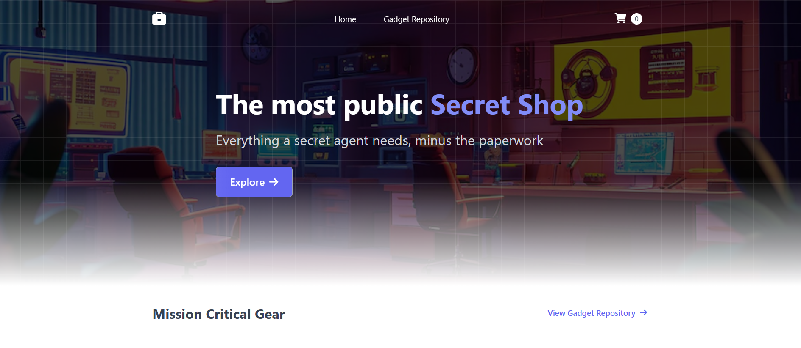
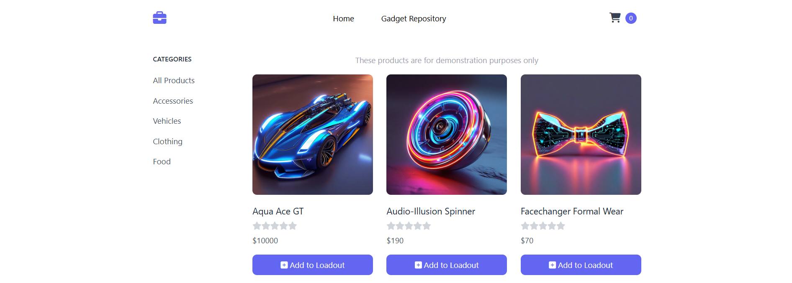
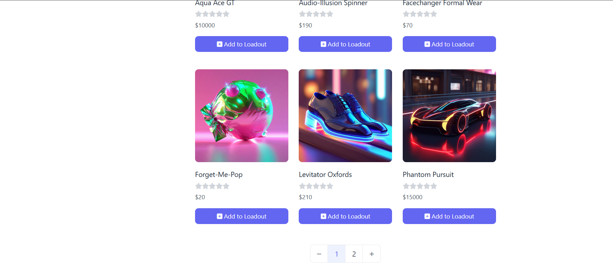
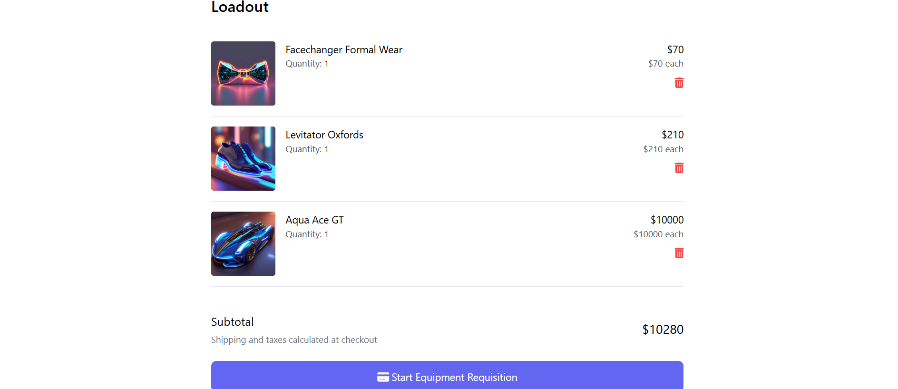

# InnovateMart – Project Bedrock

## Introduction & Company Background

**Company:** InnovateMart Inc.  
**Role:** Cloud DevOps Engineer  
**Project:** Project Bedrock – Deploy the Retail Store Sample App to a production-grade EKS environment

InnovateMart is a rapidly growing e-commerce startup that recently secured Series A funding to scale operations globally. The engineering team has been actively modernizing the legacy monolithic application into a scalable **microservices architecture**.

As the Cloud DevOps Engineer for Project Bedrock, my responsibility was to lay the foundation for the cloud infrastructure and deploy the Retail Store Application on **Amazon Elastic Kubernetes Service (EKS)**. This project is critical for the company’s future expansion and ensures a world-class shopping experience for customers.

## Mission

The primary objective of Project Bedrock was to deploy the complete `retail-store-sample-app` to a **new EKS cluster** while ensuring:

- **Automation:** Infrastructure provisioning and deployments are fully automated using Terraform and GitHub Actions CI/CD.  
- **Stability:** All microservices run reliably and communicate correctly with in-cluster dependencies.  
- **Scalability:** The infrastructure and Kubernetes setup are production-ready and can be scaled as needed.  
- **Security:** Access controls and IAM roles follow the principle of least privilege, including read-only access for developers.

This README documents the **step-by-step process**, key decisions, fixes, and workflows that were used to achieve a fully functional EKS deployment of the retail-store-sample-app.

## Live Demo

You can explore the running Retail Store Application here:  
[Retail Store Sample App](http://a0c3922ab44424a6d82eb8c25517842d-16943992.eu-west-1.elb.amazonaws.com/)

### Screenshots

#### Home Page


#### Product Catalog


#### Product Catalog


#### Cart Page



## Core Requirements – Infrastructure as Code (IaC)

The first step in Project Bedrock was to provision all necessary AWS resources using **Terraform**, ensuring the infrastructure is **automated, reproducible, and secure**. This included creating a VPC, subnets, an EKS cluster, and the required IAM roles and policies.

### Terraform Implementation

All Terraform files are located in the `infrastructure/terraform` folder. The structure is as follows:

| File           | Purpose                                                                 |
|----------------|-------------------------------------------------------------------------|
| `vpc.tf`       | Defines the Virtual Private Cloud (VPC), including public and private subnets, route tables, and internet gateways. |
| `eks.tf`       | Provisions the Amazon EKS cluster and node groups for running Kubernetes workloads. |
| `iam.tf`       | Creates IAM roles and policies for the EKS cluster, worker nodes, and service accounts. |
| `outputs.tf`   | Defines outputs such as VPC ID, Subnet IDs, and EKS cluster endpoint for use by other modules or documentation. |
| `providers.tf` | Configures the AWS provider and Terraform backend.                       |
| `variables.tf` | Declares input variables for flexible configuration (e.g., region, instance types, cluster name). |

### Process & Workflow

1. **Terraform Initialization:**  
   Initialized the working directory and modules with `terraform init`.

2. **Validation & Formatting:**  
   Ensured configuration syntax was correct with `terraform validate` and formatted files using `terraform fmt`.

3. **Execution Plan:**  
   Generated the execution plan using `terraform plan -out=tfplan` to preview changes before applying.

4. **Infrastructure Provisioning:**  
   Applied the plan with `terraform apply -auto-approve tfplan`, creating the VPC, subnets, EKS cluster, and IAM roles.

5. **Verification:**  
   Verified outputs using `terraform output` to confirm all resources were created correctly, including:
   - VPC and Subnet IDs
   - EKS cluster endpoint and cluster name
   - IAM roles and policies

### Notes & Best Practices

- State files (`*.tfstate`) and backups are excluded from the repository via `.gitignore` for security.  
- AWS credentials are never hardcoded and are managed through the CLI or environment variables.  
- The GitHub Actions workflow (`.github/workflows/terraform.yml`) automates **plan and apply** operations when changes are pushed to the main branch.  
- Always review the Terraform plan in production environments before applying changes.  

### Key Decisions

- Chose **Terraform** for its modularity and strong AWS support.  
- Created separate modules for VPC, EKS, and IAM to keep the infrastructure code organized and reusable.  
- Followed the **principle of least privilege** for IAM roles to secure cluster operations.  


## Application Deployment

Once the infrastructure was provisioned, the next step was to deploy the **Retail Store Sample App** and its supporting services to the EKS cluster. For the initial deployment, all dependencies—databases and message brokers—were run **in-cluster**, as required.

The deployment ensures that each microservice can communicate with its dependencies within the cluster and that the application is fully functional.

### Kubernetes Manifests

All Kubernetes manifests are located in the `k8s/manifests` folder, organized as follows:

| Folder / File                  | Purpose                                                                 |
|--------------------------------|-------------------------------------------------------------------------|
| `db/secrets.yaml`              | Stores sensitive data such as database credentials.                     |
| `deployments/`                 | Deployment manifests for microservices (`api`, `carts`, `catalog`, `orders`, `ui`) and supporting components (`mysql`, `postgres`, `redis`, `rabbitmq`, `dynamodb-local`). |
| `services/db-services.yaml`    | Service manifests for internal communication between microservices and databases. |
| `ingress/retail-store-ingress.yaml` | Defines Ingress rules to expose the UI externally via the NGINX Ingress Controller. |

### Deployment Workflow

1. **Apply Secrets:**  
   Store database credentials and other sensitive data:
   ```
   kubectl apply -f k8s/manifests/db/secrets.yaml
   ```

2. **Deploy Microservices:**  
   Deploy all application and supporting microservices:
   ```
   kubectl apply -f k8s/manifests/deployments/
   ```

3. **Deploy Services:**  
   Create internal ClusterIP services to allow pods to communicate:
   ```
   kubectl apply -f k8s/manifests/services/
   ```

4. **Deploy Ingress:**  
   Expose the UI service via the NGINX Ingress Controller:
   ```
   kubectl apply -f k8s/manifests/ingress/
   ```

5. **Verify Deployment:**  
   Check that all pods, services, and ingress resources are running as expected:
   ```
   kubectl get pods -A
   kubectl get svc -A
   kubectl get ingress -A
   ```

### Notes & Fixes

- In-cluster dependencies: For this core deployment, MySQL, PostgreSQL, Redis, RabbitMQ, and DynamoDB Local run inside Kubernetes pods.

- LoadBalancer adjustments: The orders service initially used a LoadBalancer type but was switched to ClusterIP since it communicates internally only; this prevented unnecessary extra AWS LBs.

- Ingress adjustments: The catalog service was removed from the ingress since it is already accessible via the UI, preventing duplicate exposure.

- Namespace: All deployments are in the default namespace unless otherwise noted.

### Verification

After deployment, the application was fully accessible, with all microservices communicating correctly and no errors in logs. This confirms that the core deployment meets the assessment requirements for running in-cluster dependencies.

## Developer Access – Read-Only IAM User

To provide our development team access to the EKS cluster without granting modification privileges, a **read-only IAM user** was created. This user can **view logs, describe pods, check service status, and explore resources**, but cannot make any changes to the cluster or underlying AWS infrastructure.

### IAM User Setup

1. **Create IAM User:**  
   - User name: `Bedrock-DevUser`  
   - Programmatic access enabled (for `kubectl` access via AWS CLI)

2. **Assign Read-Only Permissions:**  
   - Attached the built-in **`ReadOnlyAccess`** AWS managed policy to allow viewing of AWS resources.  
   - Cluster-level Kubernetes access is controlled using **RBAC** (Role-Based Access Control).  

3. **ClusterRoleBinding for Kubernetes Access:**  
   - A **ClusterRoleBinding** was created to map the IAM user (or associated group) to the Kubernetes `view` ClusterRole.
   - Manifest (`k8s/manifests/read-only-binding.yaml`):
   ```
   apiVersion: rbac.authorization.k8s.io/v1
   kind: ClusterRoleBinding
   metadata:
     name: Bedrock-DevUser
   subjects:
   - kind: Group
     name: dev-viewers
     apiGroup: rbac.authorization.k8s.io
   roleRef:
     kind: ClusterRole
     name: view
     apiGroup: rbac.authorization.k8s.io
   ```
This binding ensures that any user in the dev-viewers group can view resources without modifying them.

### Configuration Instructions for Developers

1. **Install AWS CLI and kubectl on the local machine.**

2. **Configure AWS credentials for the read-only IAM user:**
   ```
   aws configure
   ```
   Enter the access key ID, secret access key, and default region.

3. **Update kubeconfig to allow kubectl to interact with the EKS cluster:**
   ```
   aws eks update-kubeconfig --region <region> --name <eks-cluster-name>
   ```

4. **Verify Access:**  
   The developer can check the cluster status without modifying resources:
   ```
   kubectl get pods -A
   kubectl get svc -A
   kubectl get ingress -A
   ```
### Notes

- The IAM user does not have write permissions on AWS resources.
 
- Kubernetes RBAC ensures the user can only view cluster resources and cannot deploy or delete pods, services, or other objects.
 
- Secrets are not exposed to read-only users for security compliance.

## Automation with CI/CD

To ensure reliable and automated infrastructure deployment, Project Bedrock uses **GitHub Actions** to automate Terraform operations. The pipeline validates, formats, and plans changes whenever code is pushed or a pull request is opened against the `main` branch.

### Workflow File

The workflow is defined in `.github/workflows/terraform.yml`:

```
name: Terraform CI/CD Pipeline

on:
  push:
    branches: [ main ]
  pull_request:
    branches: [ main ]

jobs:
  terraform-check:
    name: Terraform Validation & Planning
    runs-on: ubuntu-latest
    
    env:
      AWS_ACCESS_KEY_ID: ${{ secrets.AWS_ACCESS_KEY_ID }}
      AWS_SECRET_ACCESS_KEY: ${{ secrets.AWS_SECRET_ACCESS_KEY }}
      AWS_DEFAULT_REGION: eu-west-1
    
    steps:
    - name: Checkout Code
      uses: actions/checkout@v4
    
    - name: Setup Terraform
      uses: hashicorp/setup-terraform@v3
      with:
        terraform_version: 1.7.0
    
    - name: Terraform Format Check
      run: terraform fmt -check
      working-directory: infrastructure/terraform
    
    - name: Terraform Init
      run: terraform init
      working-directory: infrastructure/terraform
    
    - name: Terraform Validate
      run: terraform validate
      working-directory: infrastructure/terraform
    
    - name: Terraform Plan
      run: terraform plan
      working-directory: infrastructure/terraform
```

### Branch Strategy

- main branch:

   - Any push or pull request triggers the workflow.
   - The pipeline performs format checks, validation, and a plan of the infrastructure changes.

- Feature branches are reviewed via pull requests; only merges into main are validated and planned in CI.

### Security

- AWS credentials are managed securely using GitHub Secrets (AWS_ACCESS_KEY_ID and - AWS_SECRET_ACCESS_KEY).

- Credentials are never hardcoded in the workflow.

- AWS_DEFAULT_REGION is set via an environment variable (eu-west-1) for all Terraform commands.

### Workflow Steps

1. Checkout Code: Retrieves the latest repository contents.

2. Setup Terraform: Installs the required Terraform version (1.7.0).

3. Format Check: Ensures all .tf files are properly formatted.

4. Init: Initializes Terraform in the infrastructure/terraform folder.

5. Validate: Checks the Terraform configuration for syntax and logical errors.

6. Plan: Generates an execution plan to preview changes before applying.

### Notes

- This pipeline currently stops at the plan step; applying changes can be added as a separate workflow or manual approval step for production environments.

- Using this pipeline ensures consistent, reproducible deployments and reduces human error in provisioning infrastructure.